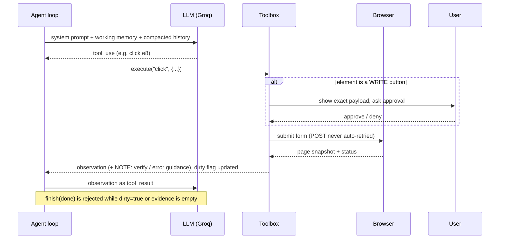

# Architecture

## Components
| File | Role |
|---|---|
| `worker/agent.py` | Loop: LLM call → one tool call → observation → repeat. Context compaction, loop detection, step budget, trace + result files. Zero task-specific code. |
| `worker/tools.py` | Tool schemas + `Toolbox`: browser, memory, ask_user, files, finish. Holds the runtime guardrails (approval gate, `dirty` flag, sandboxed paths, error containment). |
| `worker/browser.py` | Text browser: fetch (allow-listed, GET retries), parse HTML into page text + numbered elements, fill/submit forms. |
| `worker/llm.py` | `GroqLLM` (default) / `AnthropicLLM`: `complete(system, messages, tools) -> Reply`; converts history to the provider's format. The only model-specific file. |
| `worker/io.py` | Console channel for logs, `ask_user`, write approvals. |
| `mockcorp/app.py` | Sandbox company: vendor portal + ERP with deliberate faults. |
| `environment.md` | Only per-deployment config: which systems exist, URLs, sandbox creds. |

## One step of the loop


## What the model sees
```
URL: http://127.0.0.1:5001/erp/bills/new
STATUS: 422  <-- ERROR RESPONSE
--- PAGE TEXT ---
Amount must be a plain number such as 1234.50 (no currency symbol or commas).
--- ELEMENTS ---
[e5] select "Vendor" name=vendor options=[...] value="Globex Corporation"
[e7] input "Amount" name=amount type=text value=""
[e9] button "Save bill" [WRITE: changes data, needs approval]
```

## Failure handling matrix
| Situation | Handled by | Behaviour |
|---|---|---|
| Transient 5xx / network error on GET | browser | exponential-backoff retry (2×), invisible to model |
| Persistent GET failure | model | sees `ERROR RESPONSE`, re-opens or changes approach |
| Validation error on write | model | message in page text + NOTE "nothing saved"; fix and resubmit |
| 5xx on write | tools + model | NOTE: outcome UNKNOWN; must re-read before retrying (no duplicates) |
| Same action+result ×3 | agent | nudge to change approach / ask / finish |
| Model stops calling tools | agent | nudged up to 3×, then fails honestly |
| Tool raises | tools | converted to `ERROR:` observation |
| Step budget exhausted | agent | status `failed` with explanation |
| Claims "done" without checking | tools | `finish` rejected until a page is re-read after the last write |
| User denies write | tools | `DENIED`, write not performed, model told not to retry |
| Navigation off allow-list (incl. redirects) | browser | `Blocked` error |

## Generalisation
Swapping the task needs no code change. Swapping the environment needs only `environment.md` (and `--allow-host`).
Swapping the model touches only `llm.py`. Swapping the browser touches only `browser.py` (same 5 methods).
